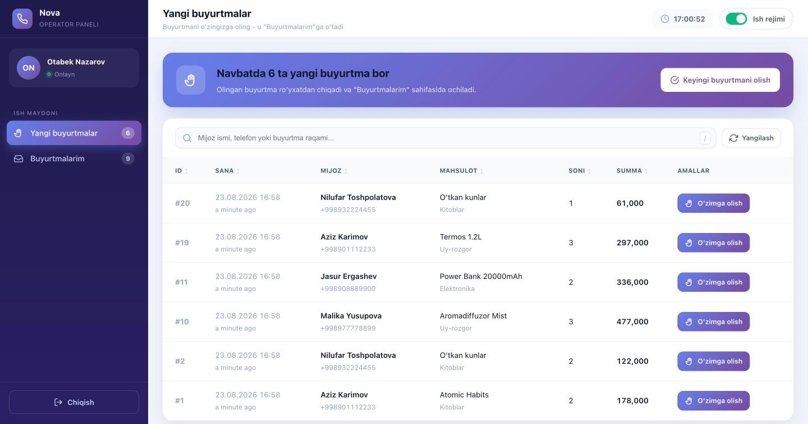
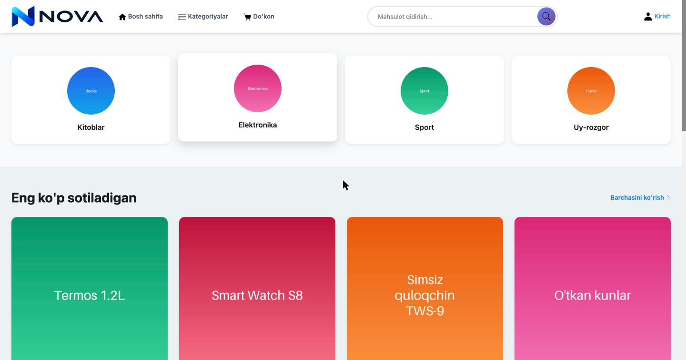
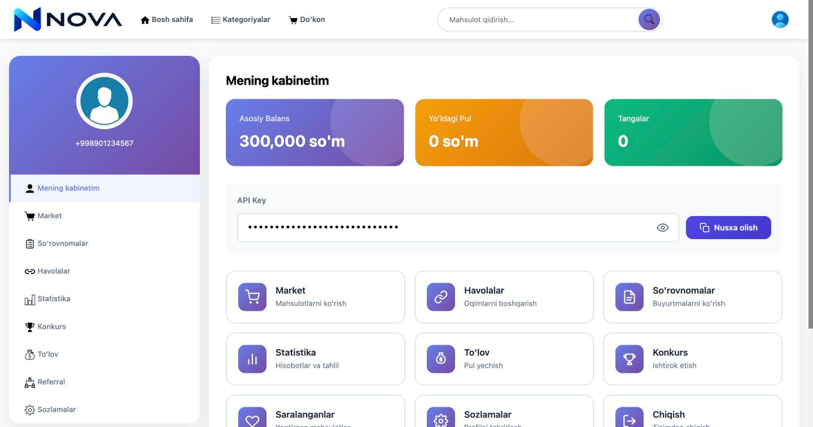
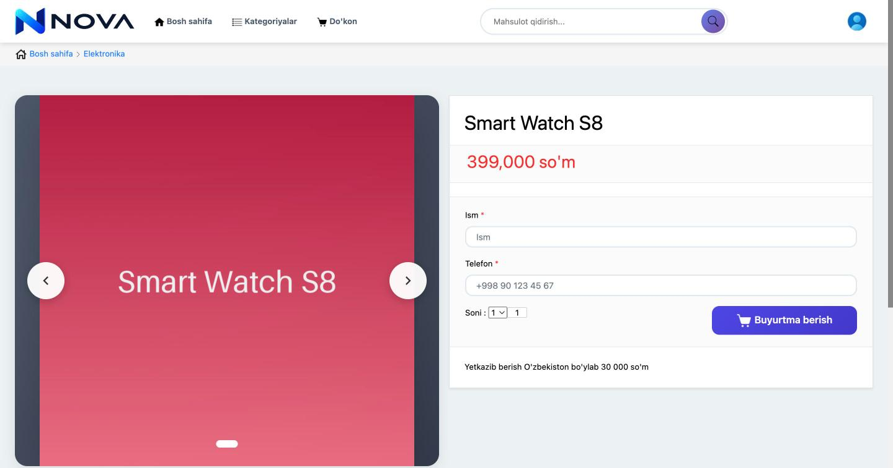

# Nova

[](https://github.com/sanjarbek-ashurboyev/Nova/actions/workflows/tests.yml)

A multi-role e-commerce and dropshipping platform built with Django, where independent
sellers promote products through personal referral links, operators process the incoming
orders, and drivers deliver them — each role with its own dedicated workspace.

Built as a full-stack portfolio project. The interface is in Uzbek, targeting the
Uzbekistan market; the codebase and this document are in English.

---

## Screenshots

**Operator workspace** — the shared order queue. Operators claim orders from here, and a
claimed order disappears from every other operator's list.



| Storefront | Seller cabinet |
|---|---|
|  |  |

**Product page** — customers order without an account; name, phone and quantity is the
whole form.



> All screenshots are of the `seed_demo` dataset. The product photography is freely
> licensed work from Openverse and Wikimedia Commons — see
> [`media/demo/CREDITS.md`](media/demo/CREDITS.md) for per-image attribution.

---

## What problem it solves

In the Uzbek social-commerce market, products are commonly resold by individuals through
Telegram and Instagram. Nova models that entire pipeline as one system:

1. A **seller** picks a product from the catalog and creates a *thread* — a personal
   landing page with their own discount carved out of the product's return margin.
2. A **customer** orders through that thread. No account required.
3. An **operator** claims the order from a shared queue, confirms it by phone, and moves
   it through the fulfilment states.
4. A **driver** picks up shipping orders and marks them delivered.
5. The seller's **balance** accrues, and they request a payout, which an admin settles.

## Roles at a glance

| Role | Workspace | Can do |
|---|---|---|
| **Customer** | Public storefront | Browse the catalog, order without registering |
| **Seller** (`user`) | `/my-cabinet/` | Create threads, track stats, invite referrals, request payouts, view survey feedback |
| **Operator** | `/operator/` | Claim orders from the queue, change status, record post-delivery surveys |
| **Driver** | `/driver/` | Take shipping orders, mark deliveries complete |
| **Admin** | `/admin/` | Full Django admin over every model |

---

## Tech stack

- **Django 6.0** — server-rendered, class-based views throughout
- **Python 3.12+** (developed on 3.14)
- **SQLite** by default; PostgreSQL via environment variables
- **Pillow** for image handling
- **Bootstrap 4** templates, no frontend build step

No REST framework, no SPA — deliberately a classic Django application, so the request
lifecycle, the ORM and the template layer carry the weight.

---

## Quick start

```bash
git clone https://github.com/sanjarbek-ashurboyev/Nova.git
cd Nova

python -m venv .venv
source .venv/bin/activate          # Windows: .venv\Scripts\activate
pip install -r requirements.txt

export DJANGO_DEBUG=1              # Windows: set DJANGO_DEBUG=1
python manage.py migrate
python manage.py seed_demo         # optional but recommended
python manage.py runserver
```

Open http://127.0.0.1:8000.

### Demo accounts

`seed_demo` builds a full dataset — 7 categories, 35 products, 24 orders spread across
every status, threads, payouts and surveys. It calls `seed_catalog` for the storefront
itself, which points the catalog at the demo photographs shipped in `media/demo/`.

To load just the catalog — 7 categories, 35 products, 69 photos, no users or orders:

```bash
python manage.py loaddata demo_catalog      # from the fixture, instant
python manage.py seed_catalog --flush       # or rebuild it from scratch
```

Both produce the same rows. The fixture (`catalog/fixtures/demo_catalog.json`) stores
image *paths*, and the files they point at live in `media/demo/`, so it works on a fresh
clone with no extra steps.

| Role | Phone | Password |
|---|---|---|
| Admin | `+998900000000` | `demo12345` |
| Seller | `+998901234567` | `demo12345` |
| Operator | `+998903456789` | `demo12345` |
| Driver | `+998905678901` | `demo12345` |

Re-run with `python manage.py seed_demo --flush` to reset.

> These credentials exist only in the local demo database. The seeder is for development
> and never runs in production.

---

## Implementation notes

A few parts that were more interesting than the CRUD around them.

### Phone-number authentication

`username` is removed from the user model entirely; `phone` is the `USERNAME_FIELD`.
Numbers are normalised to `+998XXXXXXXXX` on the way in, so `901234567`,
`+998 90 123 45 67` and `998901234567` all resolve to the same account. Sellers are
shown to each other as `+998 90 *** ** 67` — masking lives in `accounts/phone.py`
alongside the validator, and is covered by tests.

### Race-safe order claiming

Several operators watch the same queue, so claiming an order cannot be a read-then-write.
`OperatorTakeOrderView` issues a single conditional `UPDATE`:

```python
claimed = (Order.objects
           .filter(id=order_id, status=Order.OrderStatus.NEW, operator__isnull=True)
           .update(operator=request.user))
```

The database decides the winner; a return value of `0` means someone else got there
first, and the operator is told so. "Take next" wraps the same primitive in a bounded
retry loop rather than locking the table.

### Order status rules and stock

Stock is taken when an order is placed. `orders/services.py` decides where an operator
may move an order next, and puts the items back exactly once when it is cancelled or
returned:

| From | Operator may move it to |
|---|---|
| New | Packaging, Hold, Pickup later, Cancelled |
| Hold | Packaging, Pickup later, Cancelled |
| Pickup later | Packaging, Hold, Delivered (collected in person), Cancelled |
| Packaging | Shipping, Hold, Cancelled |
| Shipping | Returned. Only the driver marks it delivered |
| Delivered | Returned, Archive |
| Returned, Cancelled | Archive |

The order row is locked while the change is checked, so a double submit cannot return
the stock twice. The quantity can change only while the items are still in the
warehouse (up to Packaging). The order page offers only the statuses the order can move to.

### Balance ledger on payouts

A seller's balance has to stay correct when a payout is approved, reverted, or edited
after the fact. `Payment` snapshots its persisted state in `from_db()`, then computes a
delta inside a transaction on every save:

- `new → paid` deducts the amount
- `paid → cancelled` refunds it
- amount edited while already `paid` applies only the difference
- saving an unchanged `paid` payment does nothing

The write uses `F('balance') + delta` so concurrent updates don't clobber each other, and
a partial unique constraint (`unique_pending_payment_per_user`) stops a seller from
queuing two pending payouts at once. All eight transitions are covered in
`orders/tests.py`.

### Thread discount ceiling

A seller sets their own discount, but it can't exceed what the product can absorb.
`Thread.clean()` caps it at `min(return_price, price)` — the second term matters when a
product is priced below its return margin, which would otherwise let a thread generate a
negative order total.

### Custom password validators

`accounts/password_validation.py` replaces Django's defaults so the error messages read
naturally in Uzbek, with similarity checks bound to `phone`, `first_name`, `last_name`
and `email`.

---

## Project layout

```
root/           project settings, URLs, WSGI/ASGI
accounts/       custom user model, roles, regions/districts, auth, seller cabinet
catalog/        categories, products, images, referral threads
orders/         orders, payments, balance ledger, surveys
operator_app/   operator workspace — order queue and fulfilment
driver_app/     driver workspace — delivery queue
templates/      Bootstrap 4 templates, one base per role
static/         CSS, JS and brand assets
```

---

## Tests

```bash
DJANGO_DEBUG=1 python manage.py test   # or: make test
```

59 tests covering phone normalisation and masking, API-key generation, slug behaviour,
thread discount rules, order totals, the full payment-ledger state machine,
role-based access control for every operator and driver route, and the order status
rules with the stock each change moves.

---

## Configuration

All settings come from environment variables — see [`.env.example`](.env.example).
For local development set `DJANGO_DEBUG=1` (the `make` targets do); a git-ignored
`.secret_key` file is then generated on first run. `DEBUG` is off by default, so a server
started without configuration refuses to run instead of exposing tracebacks.

| Variable | Default | Notes |
|---|---|---|
| `DJANGO_DEBUG` | `0` | Set to `1` for local development |
| `DJANGO_SECRET_KEY` | auto (dev only) | **Required** when `DEBUG=0` |
| `DJANGO_ALLOWED_HOSTS` | `localhost,127.0.0.1` | Comma-separated |
| `DJANGO_CSRF_TRUSTED_ORIGINS` | — | Comma-separated, include the scheme |
| `DJANGO_DB_*` | SQLite | Set `ENGINE`/`NAME`/`USER`/`PASSWORD`/`HOST`/`PORT` for PostgreSQL |

With `DEBUG=0` the app refuses to start without a secret key, and switches on HSTS,
secure cookies, SSL redirect, content-type nosniff and a `same-origin` referrer policy.

## Known limitations

- **Order totals use the product's current price,** not the price when the order was placed
  ([#1](https://github.com/sanjarbek-ashurboyev/Nova/issues/1)).
- **Payout requests store the full card number.** The interface shows only the last four
  digits, but the database keeps all sixteen.
- **SQLite by default, with no Docker setup** ([#2](https://github.com/sanjarbek-ashurboyev/Nova/issues/2)).

---

## License

[MIT](LICENSE) © Sanjarbek Ashurboyev
